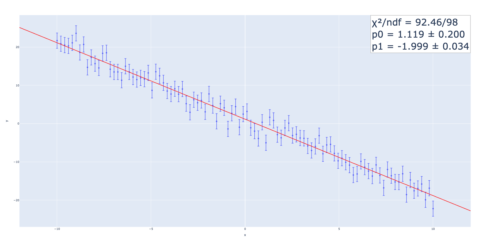
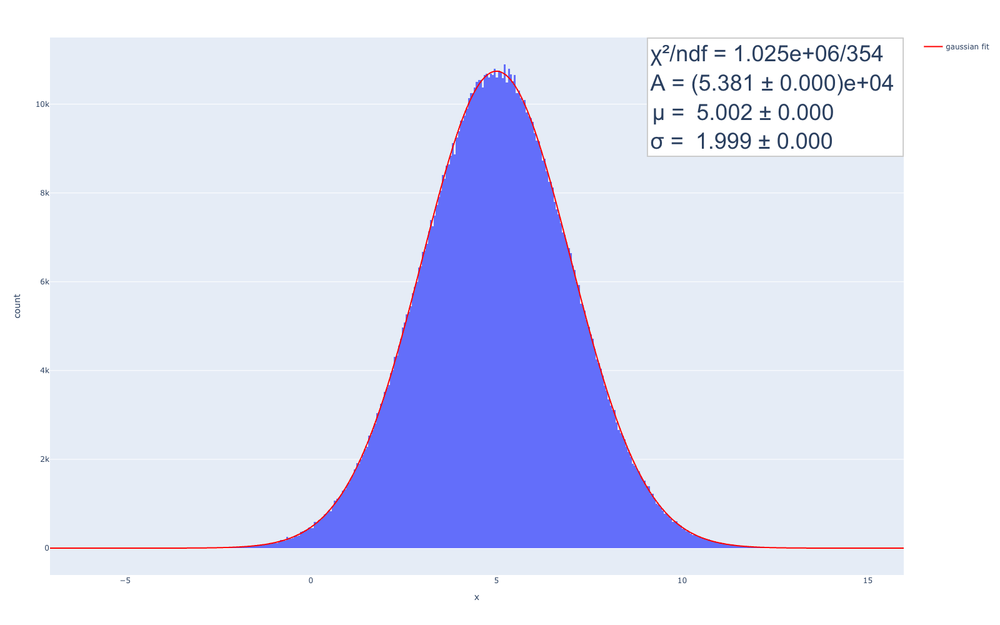
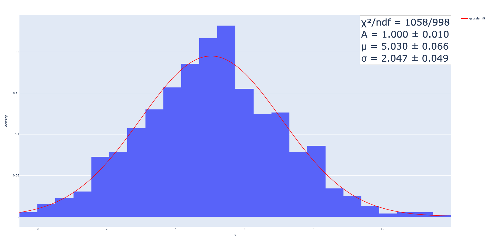

.. role:: raw-math(raw)
    :format: latex html

standard_fit
============

（適切なプロジェクト名に変更する予定）

Linear Regression
~~~~~~~~~~~~~~~~~

y = -2x + 1
^^^^^^^^^^^^^^

.. code:: python

    import numpy as np
    import plotly.express as px
    import standard_fit.plotly.express as sfpx

    x = np.linspace(-10, 10, 150)
    y_sigma = [2] * len(x)
    y = -2 * x + 1 + np.random.normal(0, y_sigma)
    fig = px.scatter(x=x, y=y, error_y=y_sigma)
    sfpx.fit(fig, "pol1")
    fig.show()

y = 2sin(x) + 5cos(2x) + 9cos(5x)
^^^^^^^^^^^^^^^^^^^^^^^^^^^^^^^^^

.. code:: python

    import numpy as np
    import plotly.express as px
    import standard_fit.plotly.express as sfpx

    x = np.linspace(-10, 10, 1000)
    y_sigma = [2] * len(x)
    y = 2 * np.sin(x) + 5 * np.cos(2 * x) + 9 * np.cos(5 * x) + np.random.normal(0, y_sigma)

    fig = px.scatter(title="Fourier-series fitting", x=x, y=y, error_y=y_sigma)
    sfpx.fit(fig, "fourier5", annotation_kwargs=dict(inside=False))
    fig.show()

    fig = px.scatter(title="Fourier-series fitting with LASSO regularization (λ=0.1)", x=x, y=y, error_y=y_sigma)
    sfpx.fit(fig, "fourier5", annotation_kwargs=dict(inside=False), fit_kwargs=dict(lasso_lambda=0.1))
    fig.show()

.. list-table::

    * - .. image:: ./fs.png
      - .. image:: ./fs_lasso.png

Note that error values cannot be calculated in linear regression with LASSO regularization.

Nonlinear Regression
~~~~~~~~~~~~~~~~~~~~

Gaussian x ~ N(5, 2)
^^^^^^^^^^^^^^^^^^^^

.. code:: python

    import numpy as np
    import standard_fit.plotly.express as sfpx

    x = np.random.normal(5, 2, size=1_000_000)
    fig = sfpx.histogram(x, fit_type="gaussian")
    fig.show()

Gaussian x ~ N(5, 2) (Unbinned Maximum Likelihood fit)
^^^^^^^^^^^^^^^^^^^^^^^^^^^^^^^^^^^^^^^^^^^^^^^^^^^^^^

.. code:: python

    import numpy as np
    import standard_fit.plotly.express as sfpx

    x = np.random.normal(5, 2, size=1_000)
    fig = sfpx.histogram(x, fit_type="gaussian", umlf=True, histnorm="probability density")
    fig.show()

