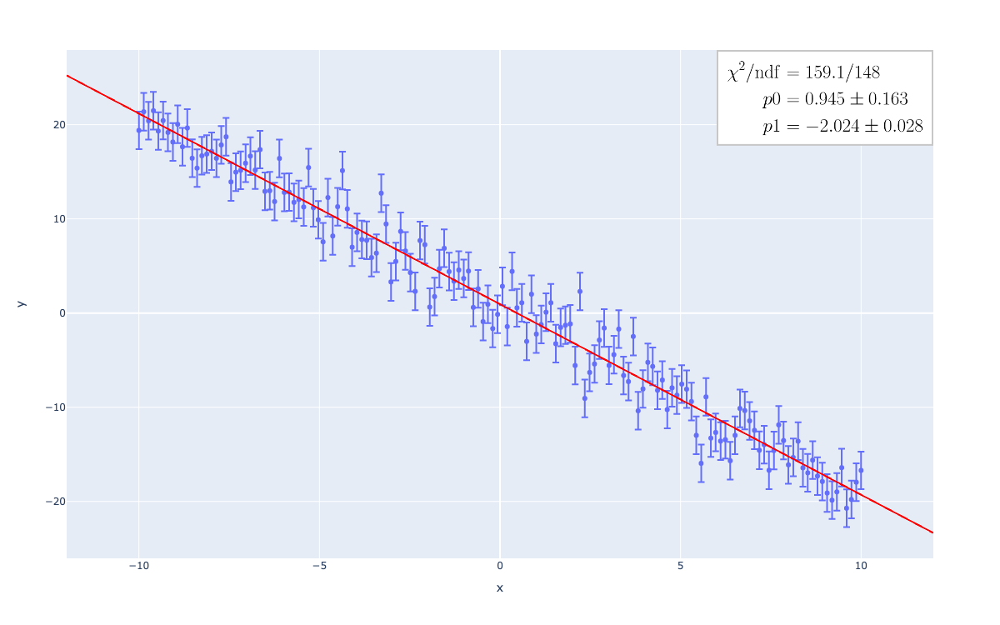
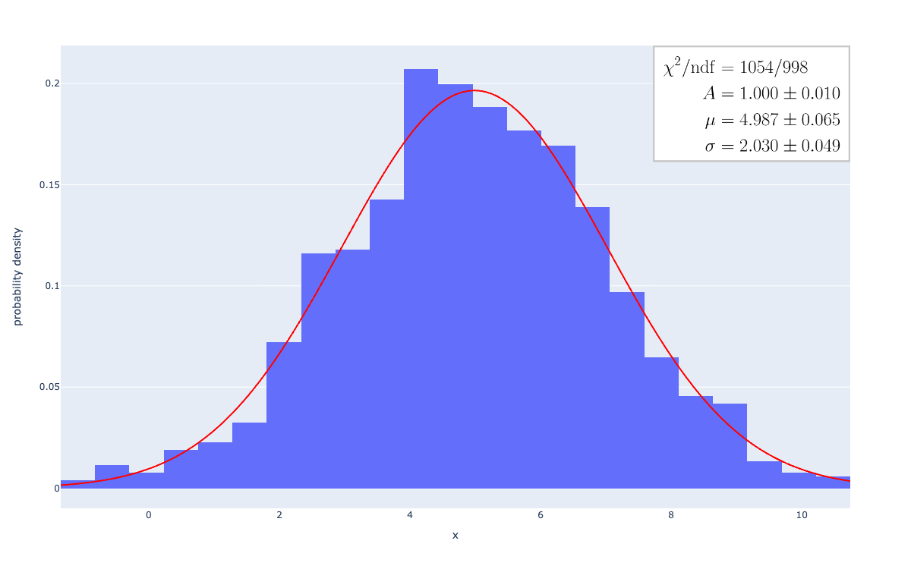

.. role:: raw-math(raw)
    :format: latex html

************
standard_fit
************

（適切なプロジェクト名に変更する予定）

.. contents:: Outline
   :depth: ３
　
one dimension
#############

Linear Regression
*****************

y = -2x + 1
===========

.. code:: python

    import numpy as np
    import plotly.express as px
    import standard_fit.plotly.express as sfpx

    x = np.linspace(-10, 10, 150)
    y_sigma = [2] * len(x)
    y = -2 * x + 1 + np.random.normal(0, y_sigma)
    fig = px.scatter(x=x, y=y, error_y=y_sigma)
    sfpx.fit(fig, "pol1")
    fig.show()

y = 2sin(x) + 5cos(2x) + 9cos(5x)
=================================

.. code:: python

    import numpy as np
    import plotly.express as px
    import standard_fit.plotly.express as sfpx

    x = np.linspace(-10, 10, 1000)
    y_sigma = [2] * len(x)
    y = 2 * np.sin(x) + 5 * np.cos(2 * x) + 9 * np.cos(5 * x) + np.random.normal(0, y_sigma)

    fig = px.scatter(title="Fourier-series fitting", x=x, y=y, error_y=y_sigma)
    sfpx.fit(fig, "fourier5", annotation_kwargs=dict(inside=False))
    fig.show()

    fig = px.scatter(title="Fourier-series fitting with LASSO regularization (λ=0.1)", x=x, y=y, error_y=y_sigma)
    sfpx.fit(fig, "fourier5", annotation_kwargs=dict(inside=False),
             fit_kwargs=dict(linear_regression_kwargs=dict(lasso_lambda=0.1)))
    fig.show()

.. list-table::

    * - .. image:: sample_images/./fs.png
      - .. image:: sample_images/./fs_lasso.png

Note that error values cannot be calculated in linear regression with LASSO regularization.

Nonlinear Regression
********************

Gaussian x ~ N(5, 2)
====================

.. code:: python

    import numpy as np
    import standard_fit.plotly.express as sfpx

    x = np.random.normal(5, 2, size=1_000_000)
    fig = sfpx.histogram(x=x, fit_type="gaussian")
    fig.show()

Gaussian x ~ N(5, 2) (Unbinned Maximum Likelihood fit)
======================================================

.. code:: python

    import numpy as np
    import standard_fit.plotly.express as sfpx

    x = np.random.normal(5, 2, size=1_000)
    fig = sfpx.histogram(x=x, fit_type="gaussian", umlf=True, histnorm="probability density")
    fig.show()

multi dimension
###############

Nonlinear Regression
********************

2D Gaussian x ~ N([10, -10], [[10, 5], [5, 10]])
================================================

.. code:: python

    import numpy as np
    import standard_fit.plotly.express as sfpx
    import scipy.stats

    xv, yv = np.meshgrid(np.linspace(0, 20, 30), np.linspace(-20, 0, 30))
    x = np.stack((xv.flatten(), yv.flatten()), axis=-1)

    mean = [10, -10]
    cov = [
        [10, 5],
        [5, 10]
    ]
    error_y = [0.001] * len(x)

    y = scipy.stats.multivariate_normal.pdf(x, mean, cov) + np.random.normal(0, error_y)

    fig = sfpx.scatter_3d(
        x=x[:, 0], y=x[:, 1], z=y, error_z=error_y, fit_type="gaussian2d",
        annotation_kwargs=dict(display_matrix=True)
    )
    fig.show()

